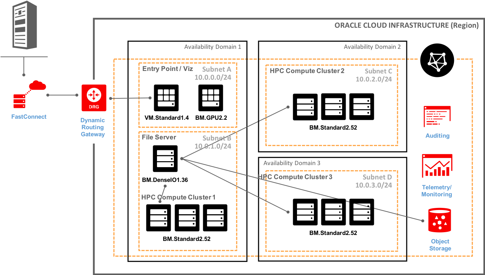
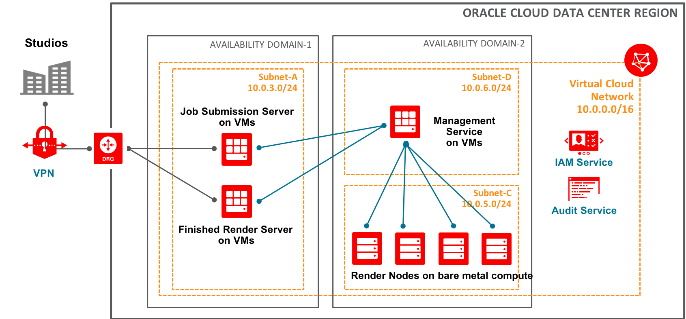

# Oracle Cloud Infrastructure 
## Quickstart ##
1)  Install Oracle Cloud Infrastructure (OCI) Command Line Interface (CLI)
2) Clone this repository
```bash
git clone https://github.com/oci-hpc/oci-hpc-ref-arch
```
3) Set environment variable C to your compartment tenancy
```bash
export C=ocid1.tenancy.oc1..aaaaaaaxxxxxxxxxxxxxxxxxxxx
```
4) Ensure that you have regional limits
5) Set region
6) Deploy
```bash
./cli_deploy.sh $C
```
7) Connect
There are multiple ways to connect to your OCI HPC cluster, open a web browser and navigate to: http://ipaddress:8080 to access a terminal or navigate to http://ipaddress/ganglia to view the installed Ganglia monitor of the cluster. Or just open up a terminal and access the cluster from opc@ipaddress.

## [DRAFT] HPC Configuration Scripts ##
These scripts represent the initial progress of the Oracle Cloud Infrastructure HPC team in developing tools that will support the product group and the field in testing, benchmarking, and deploying HPC resources on the Oracle Cloud Infrastructure.

## Table of Contents
* [Quickstart](#quickstart)
* [Purpose](#purpose)
* [Introduction](#introduction)
* [HPC in the Cloud](#hpc-in-the-cloud)
  * [OCI HPC](#oracle-cloud-infrastructure-hpc)
* [Architecture](#architecture)
  * [Reference Architecture](#example-basic-hpc-architecture)
  * [Rendering Architecture](#example-rendering-workload-hpc-architecture)

# Purpose
The purpose of this article is to provide an introduction to IaaS HPC and HPC storage in the cloud and to provide some useful tools and information to quickly setup an HPC cluster with four different types of storage. Lustre is currently the most widely used parallel file system in HPC solutions. Lustre file systems can scale to tens of thousands of client nodes, tens of petabytes of storage. Lustre file system performed well for large file system, you can refer the testing results for the same.

# Introduction
High Performance Computing and storage in the cloud can be very confusing and it can be difficult to determine where to start. This repository is designed to be a first step in expoloring a cloud based HPC storage and compute architecture. There are many different configuration that could be used, but this repository focuses on a bare metal compute system and a Lustre file system that is attached. After deployment fully independant and functioning IaaS HPC compute and storage cluster has been deployed based on the architecture below.

# HPC in the Cloud
## HPC in the cloud continues to gain momentum.
- [Inside HPC Article](https://insidehpc.com/2017/03/long-rise-hpc-cloud/)
- [The Cloud is Great for HPC](https://www.theregister.co.uk/2017/06/16/the_cloud_is_great_for_hpc_discuss/)

## Oracle Cloud Infrastructure HPC
The bare metal offerings from OCI provide a significant edge in running HPC workloads on the cloud, [OCI offerings and performance](https://blogs.oracle.com/cloud-infrastructure/high-performance-computing-with-oracle-bare-metal-cloud-compute-service). OCI HPC offers 1,214% better storage performance at 88% lower cost per IO than its competitors.

All of Oracle Cloud Infrastructure’s new compute instances leverage Intel’s latest Xeon processors based on the Skylake architecture. Oracle’s accelerated bare metal shapes are also powered by NVIDIA Tesla P100 GPUs, based on the Pascal architecture. Providing 28 cores, dual 25Gb network interfaces for high-bandwidth requirements and over 18 TFLOPS of single-precision performance per instance, these GPU instances accelerate computation-heavy use cases such as reservoir modeling, AI, and Deep Learning.

In addition, Oracle’s new VM standard shape is now available in 1, 2, 4, 8, 16, and 24 cores, while the bare metal standard shape offers 52 cores, the highest Intel Skylake-based CPU count per instance of any cloud vendor. Combined with its high-scale storage capacity, supporting up to 512 terabytes (TB) of non-volatile memory express (NVMe) solid state drive (SSD) remote block volumes, these instances are ideal for traditional enterprise applications that require predictable storage performance.

The Dense I/O shapes are also available in both VM and bare metal instances and are optimal for HPC, database applications, and big data workloads. The bare metal Dense I/O shape is capable of over 3.9 million input/output operations per second (IOPS) for write operations. It also includes 51 TB of local NVMe SSD storage, offering 237 percent more capacity than competing solutions1.

### Some OCI HPC Links
- Recent OCI HPC [press release](https://www.oracle.com/corporate/pressrelease/oracle-infrastructure-delivers-ai-performance-value-11162017.html)
- Predictable HPC performance [Case Study](https://cloud.oracle.com/opc/paas/datasheets/Zenotech_customer_case_study_final.pdf)
- Oracle HPC Customer [Testimonial](https://video.oracle.com/detail/videos/most-recent/video/5670450923001/zenotech-finds-oci-simple-fast-and-scalable?autoStart=true)

		
# Architecture
## Example Basic HPC Architecture


## Example Rendering Workload HPC Architecture


